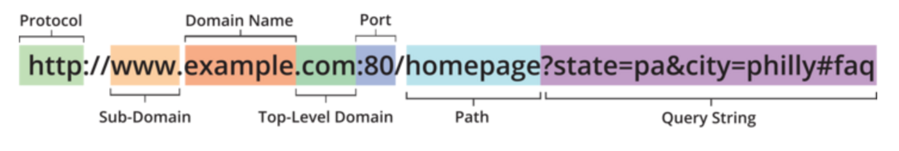

[Learning Experience](https://coursework.galvanize.com/redirects/learning_experiences/129)

# Objectives
- Describe the purpose of a web server  

- Describe the parts of a URL

- [Describe the HTTP protocol](https://github.com/robhaj/http-protocol)
  - Identify the components of a [request](https://github.com/robhaj/http-protocol#http-request) and [response](https://github.com/robhaj/http-protocol#http-response)
- Understand that HTTP requests and responses are sent as strings
- [Create an HTTP server with Node's http module](https://github.com/robhaj/node-http-server)
  - Identify the two parts of a route (method and path)
  - [Access the parts of a URL with the url module](https://github.com/robhaj/node-url-module)
